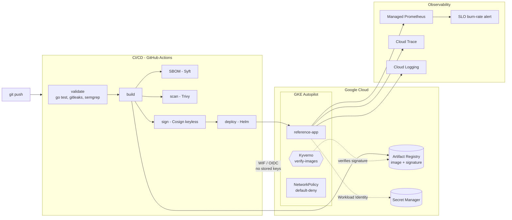

# GKE Reference Platform

A reference platform demonstrating secure, reproducible delivery to Google Kubernetes Engine: one small Go service taken from commit to a running, signed, policy-governed workload — all defined as code. Built to exercise the full platform-engineering surface: infrastructure as code, keyless CI/CD, supply-chain security, observability, and policy-as-code.

> **Scope, honestly:** this is a *reference* platform, not a production system at scale. Everything documented below was deployed and verified on a live GKE Autopilot cluster. Where something is a parallel implementation rather than a thing I ran end-to-end, it says so.

---

## Architecture



---

## CI/CD: two implementations

The same secure-delivery pipeline is expressed in two CI systems. They share the app, the Helm chart, and the security model.

| | GitHub Actions | GitLab CI |
|---|---|---|
| **Status** | **Proven end-to-end** — runs green against live GKE | Parallel implementation (reusable templates) |
| **Auth to GCP** | Keyless via Workload Identity Federation (OIDC) | Project access token / WIF |
| **Stages** | validate → build → sbom → scan → sign → deploy | validate → test → build → sbom → security → package → deploy |
| **Scanning** | Trivy (image), Gitleaks, Semgrep | Trivy + GitLab native SAST / secret / dependency scanning |
| **Signing** | Cosign keyless (Sigstore), OIDC identity | Cosign |
| **Files** | `.github/workflows/ci.yml` | `.gitlab-ci.yml`, `.gitlab/ci/*.yml` |

The GitHub Actions pipeline is the one I deployed and verified; the GitLab pipeline mirrors it for environments standardized on GitLab.

---

## What it demonstrates

**Infrastructure as code** — GKE Autopilot provisioned entirely via Terraform: VPC-native networking, Workload Identity enabled, least-privilege IAM, Artifact Registry, and the Workload Identity Federation resources for keyless CI. `terraform/`

**Supply-chain security** — every image gets an SBOM (Syft), a vulnerability scan (Trivy), and a keyless Cosign signature tied to the pipeline's OIDC identity. No long-lived signing keys. `.github/workflows/ci.yml`

**Policy as code** — Kyverno admission policy verifies image signatures against the pipeline's exact OIDC identity and rejects anything unsigned; hardening policies and a default-deny NetworkPolicy (enforced by Dataplane V2 / Cilium) complete the governance layer. `security/`

**Observability** — Managed Service for Prometheus scrapes the app, an OpenTelemetry collector exports traces to Cloud Trace, logs flow to Cloud Logging, and an SLO fast-burn alert is defined as Terraform. `observability/`, `terraform/observability.tf`

**Secrets without static credentials** — the app reads secrets from Secret Manager via External Secrets, authenticated by Workload Identity — no key files anywhere. `security/external-secrets-gcp.yaml`

---

## Key engineering decisions

These are the choices that mattered, and why — the difference between assembling a platform and understanding one.

**Workload Identity Federation over stored service-account keys.** CI authenticates to GCP by exchanging a short-lived GitHub OIDC token, scoped by an attribute condition to this repo. There is no JSON key to leak or rotate. The same Workload Identity model carries through to the running app (Secret Manager access) and to Kyverno (pulling signatures from Artifact Registry).

**Signature verification by OIDC identity, with a tag-vs-digest caveat.** Kyverno's `verifyImages` checks the Cosign signature against the exact pipeline subject (`…/ci.yml@refs/heads/main`) and issuer. Because the deploy references images by tag, digest verification is relaxed (`verifyDigest: false`); the production hardening is to deploy by digest so digest pinning can stay on — a deliberate, documented trade-off rather than an oversight.

**Kyverno needs its own identity to verify.** On Autopilot, the admission controller pulls signatures from Artifact Registry in-process, so it required its own Workload Identity binding (a dedicated GSA with `artifactregistry.reader`) — a non-obvious dependency that only surfaces under real enforcement.

**Pinned, hardened CI actions.** After a 2026 supply-chain advisory affecting a popular scanning action, scanners run as pinned versions and the lesson — pin CI actions to immutable references — is baked in. The scanner verifies the *local* build to avoid an unauthenticated registry pull.

**Autopilot's cost/latency trade-off.** Scale-to-zero saves money but adds cold-start latency to deploys; the pipeline drops Helm's blocking `--wait` and verifies rollout separately so a cold node doesn't wedge the release. On a constrained trial SSD quota, the per-node boot disk — not CPU — becomes the scaling limit, which is itself a useful FinOps observation.

---

## Repository layout

```
app/            Go service: /healthz /readyz /metrics + OTel traces; hardened distroless image
chart/          Helm chart (probes, securityContext, ServiceMonitor)
terraform/      GKE Autopilot, VPC, IAM, Workload Identity Federation, SLO alert
.github/        GitHub Actions pipeline (proven)
.gitlab/        GitLab CI templates (parallel implementation)
observability/  Managed Prometheus, OTel collector, SLO rules
security/       External Secrets, Kyverno policies, network policies
docs/           Architecture notes and per-phase runbooks
```

---

## Running it

Prerequisites: a GCP project, `gcloud`, `terraform`, `kubectl`, `helm`.

```bash
# 1. provision the platform
cd terraform
terraform init && terraform apply      # creates GKE, IAM, WIF, Artifact Registry

# 2. connect
gcloud container clusters get-credentials reference-platform --region us-central1

# 3. CI/CD takes over from a push to main — build, scan, sign, deploy.
#    The deploy job self-bootstraps the namespace, service account, and secret.
```

Per-phase runbooks with the full sequence are in [`docs/`](docs/).

---

## What I'd do next

Deploy by digest (enabling full Kyverno digest pinning), run the admission controller at ≥2 replicas for HA under `failurePolicy: Fail`, and gate the pipeline on Trivy criticals once the base image is triaged. The companion repos [`terraform-aks`](https://github.com/sebrakoczy/terraform-aks) and `terraform-eks` carry the same workload onto Azure and AWS for a multi-cloud comparison.
